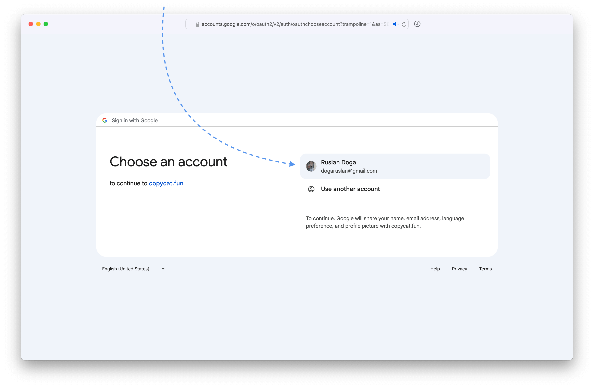

Integrating with Google either to get search keywords for hits from Google search or for imports from Universal Analytics can be frustrating.

The following screenshot-annotated guide shows how to do it all in the easiest way possible. Follow the Google-colored arrows.

Here's the outline of what we'll do:

- Set up OAuth on Google Cloud
    - Select or create a Google Cloud project
    - Register an OAuth application for a domain
    - Issue an OAuth client and key for that application
    - Verify the chosen domain on Google Search console
- Integrate with Google Search
    - Enable APIs for Google Search integration
    - Link it with Plausible
- Import historical data from Universal Analytics
    - Enable APIs for exports on Google Cloud
    - Import into Plausible

### Set up OAuth on Google Cloud

#### Select ot create a Google Cloud project

Go to [Google Cloud console,](http://console.cloud.google.com/) for example, by clicking <kbd>Go to console</kbd> on [Google Cloud landing page.](https://cloud.google.com) If Google asks you to register, just do it.


Once there, select a project that you want to use for Plausible OAuth app.


If you don't have a project already, or if you want to isolate Plausible from all your other Google Cloud things, you should create a new project.

---

<details><summary>Here's how to create a new Google Cloud project</summary>

In the <kbd>Select a project</kbd> pop-up, click <kbd>New project</kbd>


Pick a descriptive name. Organizations don't matter.


Once the project is created, select it and make sure all the other steps happen within that project. Google is tricky and sometimes switches you to a "default" project.


And just like that, you have a new Google Cloud project! Please do make sure it stays selected.

</details>

---

#### Register an OAuth application for a domain

Search for <kbd>APIs & Services</kbd> or something like that.


Then in the left sidebar pick <kbd>OAuth consent screen</kbd> to begin the OAuth application registration.


Choose <kbd>External</kbd> for the application type since the other one requires a Google Workspace and that costs money.


On the next screen pick the name for your application and add your contact information.


Scroll down -- skipping optional fields -- and type in your domain name and contact information (again).


Skip the scopes.


Pick yourself as the test user, Google might complain about it but it works.


Click the final <kbd>Save and continue</kbd> and you have the OAuth application registered.

#### Issue an OAuth client and key for that application

Pick <kbd>Credentials</kbd> in the sidebar.


Click <kbd>+ Create credentials</kbd> dropdown and select <kbd>OAuth client ID</kbd>


Pick <kbd>Web application</kbd> for the application type, type the name for the client, and add the redirect URL.


That redirect URL should be `/auth/google/callback` on your Plausible instance's [<kbd>BASE_URL</kbd>](https://github.com/plausible/hosting/blob/bb6decee4d33ccf84eb235b6053443a01498db53/plausible-conf.env#L1)


Copy these to your [<kbd>plausible-conf.env</kbd>](https://github.com/plausible/hosting/blob/master/plausible-conf.env) and make sure to recreate the `plausible` container since the ENV vars provided on startup get "baked in"

<sub><kbd>plausible-conf.env</kbd></sub>
```env
GOOGLE_CLIENT_ID=974728454958-e1vcqqqs6hmoc394663kjrkgfajrifdg.apps.googleusercontent.com
GOOGLE_CLIENT_SECRET=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
```
<sub><kbd>console</kbd></sub>
```console
$ docker compose stop plausible
[+] Running 1/1
 ⠿ Container hosting-plausible-1  Stopped
$ docker compose rm plausible
? Going to remove hosting-plausible-1 Yes
[+] Running 1/0
 ⠿ Container hosting-plausible-1  Removed
$ docker compose create plausible
[+] Running 4/0
 ⠿ Container hosting-plausible_events_db-1  Running 0.0s
 ⠿ Container hosting-mail-1                 Running 0.0s
 ⠿ Container hosting-plausible_db-1         Running 0.0s
 ⠿ Container hosting-plausible-1            Created
$ docker compose start plausible
[+] Running 3/3
 ⠿ Container hosting-plausible_db-1         Healthy 0.5s
 ⠿ Container hosting-plausible_events_db-1  Healthy 0.5s
 ⠿ Container hosting-plausible-1            Started
$ docker compose exec plausible sh -c 'echo $GOOGLE_CLIENT_ID'
974728454958-e1vcqqqs6hmoc394663kjrkgfajrifdg.apps.googleusercontent.com
```

#### Verify the chosen domain on Google Search console

Did you notice that during OAuth application registratation there was a note about Authorized URLs saying that they need to be verified? Nevermind, we are doing it now.

Start by navigating to [Google Search Console page.](http://search.google.com/u/1/search-console/welcome) 

Once there, either ensure that you've already verified your domain by checking the properties in the <kbd>Select property</kbd> dropdown on the left or pick one of the two ways to verify it. I only have screenshots for the "Domain" type so that's what I'm picking.


Whichever you pick, just follow the instruction in the pop-up, they are good.


Success looks like this.


With that, you are ready to integrate Plausible with Google Search and import Universal Analytics data. You can do both, neither, and anything in between.

### Integrate with Google Search

#### Enable APIs for Google Search integration

Go back to [Google Cloud,](https://console.cloud.google.com) ensure you have the correct project selected, and search for <kbd>Google Search Console API</kbd>


Enable it.


#### Link it with Plausible

Go to the site settings on your Plausible dashboard.


In the settings select <kbd>Search Console</kbd> and press <kbd>Continue with Google</kbd>

> If you see a warning instead, that means you haven't set the <kbd>GOOGLE_CLIENT_ID</kbd> and <kbd>GOOGLE_CLIENT_SECRET</kbd> environment variables [correctly.](#issue-an-oauth-client-and-key-for-that-application)


Choose the account that you added as the test user.



Trust our own application.


Allow viewing Search Console data.


Pick the property from Search Console.


And now we should be able to drilldown into Google search terms like on [plausible.io](https://plausible.io/plausible.io/referrers/Google?source=Google)

### Import historical data from Universal Analytics

#### Enable APIs for exports on Google Cloud

Go back to [Google Cloud,](https://console.cloud.google.com) ensure you have the correct project selected, and search for <kbd>Google Analytics API</kbd>


Enable it.


Next search for <kbd>Google Analytics Reporting API</kbd>


And enable it.


#### Import into Plausible

Go to the site settings on your Plausible dashboard.


In the <kbd>General</kbd> settings section scroll down to <kbd>Data Import from Google Analytics</kbd> and press  <kbd>Continue with Google</kbd> button.

> If you see a warning instead, that means you haven't set the <kbd>GOOGLE_CLIENT_ID</kbd> and <kbd>GOOGLE_CLIENT_SECRET</kbd> environment variables [correctly.](#issue-an-oauth-client-and-key-for-that-application)


Choose the account that you added as the test user.


Trust our own application.


Pick the view to import and then follow the Plausible directions.


You'll receive an email once the data is imported.
